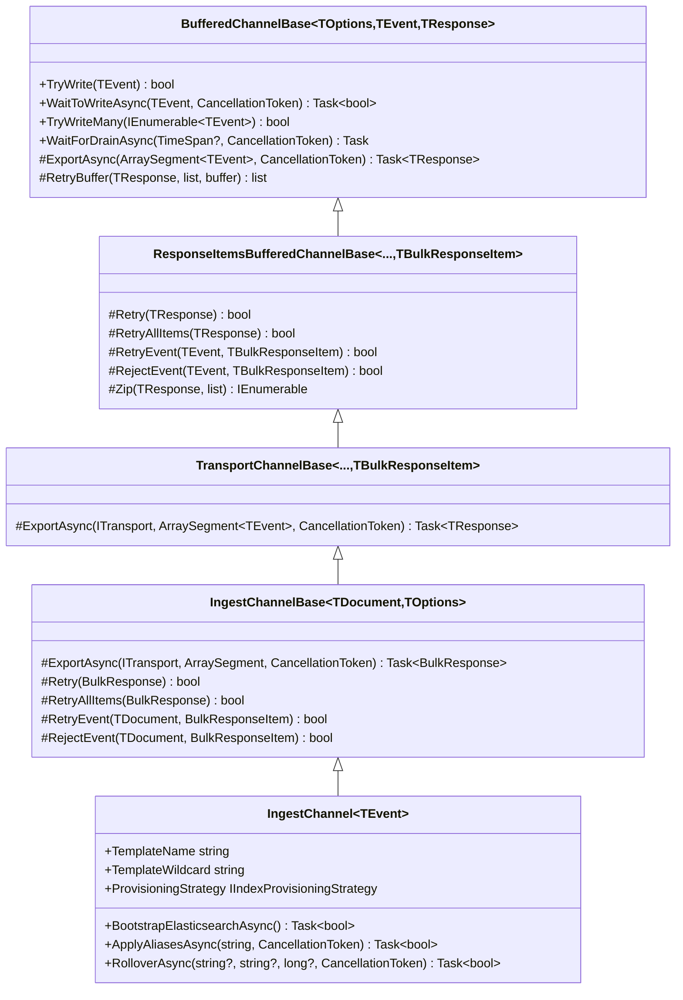

# Channel hierarchy

`IngestChannel<T>` is the top of a layered class hierarchy. Each layer adds a specific capability.

## Class diagram

## Layer responsibilities

### BufferedChannelBase

The foundation layer in `Elastic.Channels`. Provides:

- Two-stage inbound/outbound buffer (see [push model](push-model.md))
- Concurrent export with throttling
- Backpressure and drain
- Retry with configurable backoff

All buffer configuration, threading, and lifecycle management lives here.

### ResponseItemsBufferedChannelBase

Adds per-item response analysis. Where the base class treats a response as pass/fail for the whole batch, this layer can:

- Zip sent items with individual response items
- Decide per-item whether to retry, reject, or accept
- Retry the entire batch for certain response codes (for example, HTTP 429)

### TransportChannelBase

In `Elastic.Ingest.Transport`. Integrates `ITransport` from `Elastic.Transport`:

- Passes the transport instance to `ExportAsync`
- Subclasses implement `ExportAsync(ITransport, ArraySegment<TEvent>, CancellationToken)` to make HTTP calls

### IngestChannelBase

In `Elastic.Ingest.Elasticsearch`. Implements the Elasticsearch `_bulk` API:

- Serializes documents into NDJSON bulk format
- Parses `BulkResponse` and maps items
- Defines retry status codes (429, 500-599)
- Defines rejection criteria (non-2xx that aren't retryable)

### IngestChannel&lt;T&gt;

The composable channel that users interact with. Adds:

- [Strategy pattern](../strategies/index.md) for bootstrap, ingest, provisioning, alias, and rollover
- Auto-configuration from `ElasticsearchTypeContext`
- Public API for bootstrap, alias management, and rollover

## Legacy channels

Before `IngestChannel<T>`, specialized channel subclasses existed for each use case. These are now obsolete. See [legacy channels](../channels/legacy-channels.md) for migration guidance.
