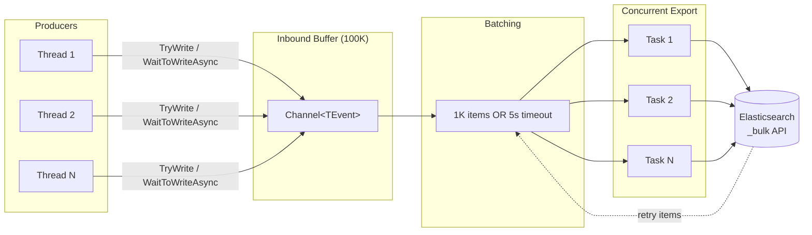

# Push model

`Elastic.Channels` implements a two-stage buffered push model. Producers write documents into an inbound channel; the library batches, throttles, and exports them concurrently to a backend (Elasticsearch in this case).

## Data flow



## Two-stage buffer

### Stage 1: Inbound channel

A `BoundedChannel<TEvent>` accepts writes from any number of producers. The channel capacity is controlled by `InboundBufferMaxSize` (default: 100,000).

An `InboundBuffer` accumulates items until one of two thresholds is hit:

- **Count threshold**: items reach `OutboundBufferMaxSize` (default: 1,000)
- **Time threshold**: time since first write exceeds `OutboundBufferMaxLifetime` (default: 5 seconds)

The inbound buffer uses `ArrayPool<TEvent>` to minimize allocations.

### Stage 2: Outbound channel

When thresholds are hit, the inbound buffer is flushed into an `OutboundBuffer` (an `ArraySegment<TEvent>` view over the pooled array). This buffer is written to a bounded outbound channel with capacity `MaxConcurrency * 4`.

Export tasks read from the outbound channel and call `ExportAsync` with each batch.

## Backpressure

Two modes control behavior when the inbound buffer is full:

| Mode | Behavior |
|------|----------|
| `BoundedChannelFullMode.Wait` (default) | `WaitToWriteAsync` blocks the producer until space is available |
| `BoundedChannelFullMode.DropWrite` | Drops the item and invokes the `BufferItemDropped` callback |

When the number of inflight events approaches `InboundBufferMaxSize - DrainSize`, `WaitToWriteAsync` applies incremental 100ms delays (up to 1 second) to slow producers before the channel fills completely.

`TryWrite` is non-blocking and returns `false` if the buffer is full.

## Concurrent export

Export concurrency is calculated automatically:

```
MaxConcurrency = Min(Ceil(InboundBufferMaxSize / OutboundBufferMaxSize), ProcessorCount * 2)
```

A semaphore limits the number of concurrent `ExportAsync` calls to `MaxConcurrency`. You can override this with `BufferOptions.ExportMaxConcurrency`.

## Retry with backoff

When an export fails or returns retryable items:

1. The channel calls `RetryBuffer` to determine which items to retry
2. Retryable items are re-exported up to `ExportMaxRetries` times (default: 3)
3. Each retry waits according to `ExportBackoffPeriod` (default: `2 * (attempt + 1)` seconds)

For Elasticsearch specifically:
- HTTP 429 (Too Many Requests) retries the entire batch
- HTTP 500-599 retries individual failed items
- Items with non-2xx status codes that aren't retryable are rejected

## Drain

`WaitForDrainAsync` provides graceful shutdown:

```csharp
await channel.WaitForDrainAsync(TimeSpan.FromSeconds(30), ctx);
```

The drain:
1. Closes the inbound channel (no new writes accepted)
2. Waits for all inflight events to be exported
3. Waits for all export operations to complete
4. Respects the timeout -- returns when complete or when time expires

If `maxWait` is `null`, the drain waits indefinitely, scaling the timeout based on the number of pending export batches.

## BufferOptions reference

| Option | Type | Default | Description |
|--------|------|---------|-------------|
| `InboundBufferMaxSize` | `int` | 100,000 | Maximum items queued in memory |
| `OutboundBufferMaxSize` | `int` | 1,000 | Maximum batch size per export call |
| `OutboundBufferMaxLifetime` | `TimeSpan` | 5 seconds | Maximum time before a partial batch is flushed |
| `ExportMaxConcurrency` | `int?` | Auto-calculated | Number of concurrent export tasks |
| `ExportMaxRetries` | `int` | 3 | Maximum retry attempts per batch |
| `ExportBackoffPeriod` | `Func<int, TimeSpan>` | `2*(i+1)` seconds | Backoff delay per retry attempt |
| `BoundedChannelFullMode` | `BoundedChannelFullMode` | `Wait` | Behavior when inbound buffer is full |

## Short-lived vs long-lived channels

**Long-lived** (continuous ingestion):
- Create the channel once, write continuously
- Buffer tuning matters: increase `InboundBufferMaxSize` and `ExportMaxConcurrency` for high throughput
- Call `WaitForDrainAsync` only at shutdown

**Short-lived** (batch import):
- Create the channel, write a batch, drain, dispose
- Default buffer sizes work well for most batch sizes
- Always call `WaitForDrainAsync` before disposing to avoid data loss
