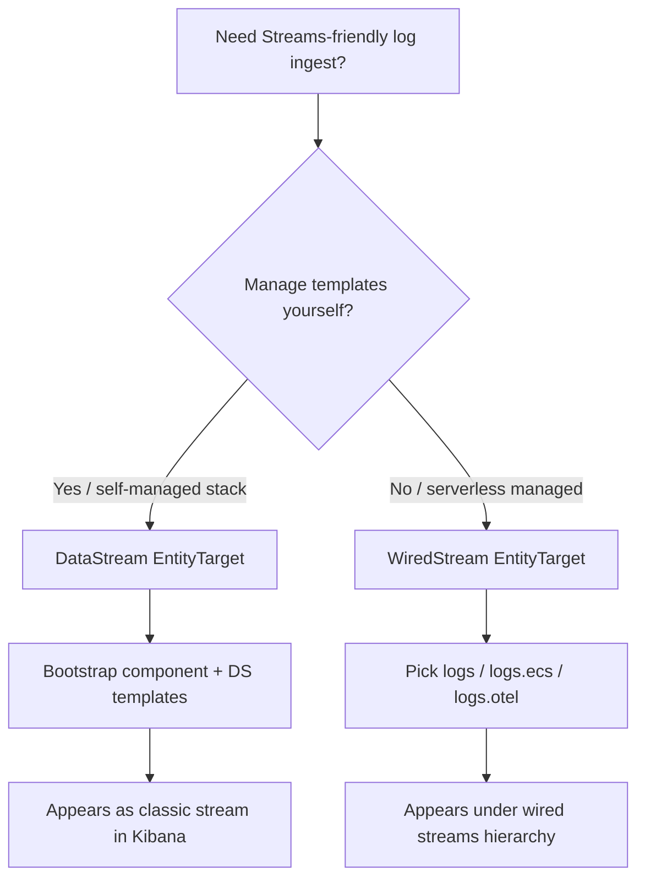

# Streams

[Kibana Streams](https://www.elastic.co/docs/solutions/observability/streams/streams) is a centralized UI for managing Elasticsearch data streams: retention, field extraction, routing into child streams, and data quality. This library maps to Streams through two ingest targets.

## Terminology

| Kibana Streams | This library | What it means |
|----------------|--------------|---------------|
| Classic stream | `[DataStream<T>]` | You own templates. Bootstrap creates component + data stream templates. |
| Wired stream | `[WiredStream<T>]` | Elasticsearch manages templates and lifecycle. Bulk goes to a managed endpoint. |

Classic streams work with existing `{type}-{dataset}-{namespace}` data streams. Wired streams are the managed ingest path (Elastic Stack 9.2+ / serverless preview) that supports hierarchical inheritance and cascading configuration.

## Choosing a target

| Use case | Attribute | Guide |
|----------|-----------|-------|
| Append-only logs/metrics with local mappings | `[DataStream<T>]` | [Data streams](data-streams.md) |
| LogsDB storage mode | `[DataStream<T>(DataStreamMode = LogsDb)]` | [LogsDB](logsdb.md) |
| Managed wired ingest (serverless / Streams) | `[WiredStream<T>]` | [Wired streams](wired-streams.md) |
| ECS documents from ecs-dotnet | `[WiredStream<T>(IngestEndpoint = LogsEcs)]` | [ECS and OTel endpoints](ecs-and-otel-endpoints.md) |

## What Kibana owns after ingest

Once documents land in Streams, Kibana features operate on them. The .NET library does **not** author Streamlang or extract knowledge indicators — those are configured in Kibana (or via the Streams API).

See [Downstream Streams features](streams-downstream-features.md) for how document shape affects Streamlang, significant events, and knowledge indicators.

## Related Elastic docs

- [Streams overview](https://www.elastic.co/docs/solutions/observability/streams/streams)
- [Get data into Streams](https://www.elastic.co/docs/solutions/observability/streams/get-data-in)
- [Wired streams field naming](https://www.elastic.co/docs/solutions/observability/streams/wired-streams-field-naming)
- [Streamlang](https://www.elastic.co/docs/solutions/observability/streams/streamlang)
- [Knowledge indicators](https://www.elastic.co/docs/solutions/observability/streams/knowledge-indicators)
