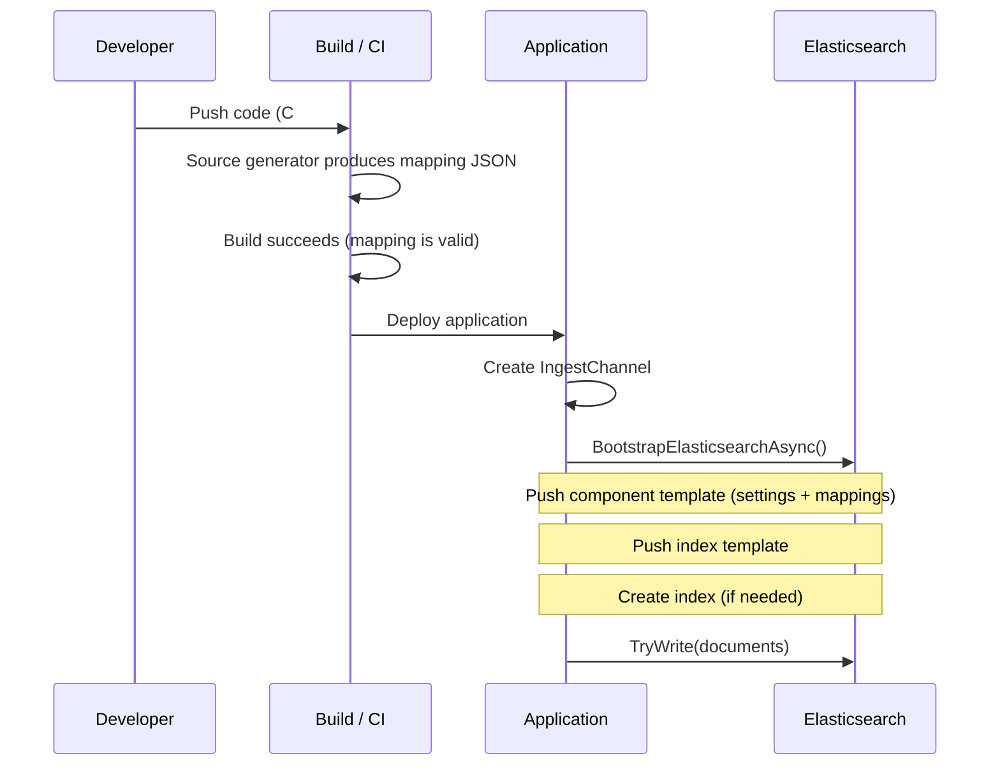

# How mapping deploys with your application

With `Elastic.Mapping`, your Elasticsearch mapping is compiled into your application binary. When the application starts and creates an ingest channel, the mapping is automatically pushed to Elasticsearch as component and index templates. There is no separate deployment step, no out-of-band script, no ops ticket.

## The deployment flow



## What bootstrap does

When your application calls `channel.BootstrapElasticsearchAsync()`, the channel:

1. Reads the generated mappings and settings JSON from the compiled context
2. Merges in any custom analysis or index settings
3. Computes a content hash of the final template body
4. Checks if the component template in Elasticsearch already has the same hash
5. If unchanged, skips the update (no-op)
6. If changed, creates or updates the component template and index template
7. Provisions the index according to the strategy (create new, or reuse existing)

:::{tip}
The hash-based check means your application can bootstrap on every startup without causing unnecessary template updates. Only actual mapping changes trigger writes to Elasticsearch.
:::

## What this means in practice

### No more "did someone apply the mapping?"

The mapping is part of the application. If the app is running, the mapping is applied. There is no window where the app is deployed but the mapping is stale.

### Rolling updates are safe

When you deploy a new version with an updated mapping:

1. The new instance starts and calls `BootstrapElasticsearchAsync()`
2. The hash differs from the existing template, so it updates the template
3. Depending on your strategy, it either creates a new index (for date-rolling patterns) or the template applies to the next index creation

For date-rolling indices with aliases, this means zero-downtime schema evolution: the old index keeps the old mapping, the new index gets the new mapping, and the write alias swaps automatically.

### Mapping changes are auditable

Because the mapping is derived from your C# class, every change shows up in your version control history:

```diff
 public class Product
 {
     [Id]
     [Keyword]
     public string Sku { get; set; }

     [Text(Analyzer = "product_name_analyzer")]
     public string Name { get; set; }

+    [Text(Analyzer = "product_name_analyzer")]
+    public string Description { get; set; }
+
     [Keyword(Normalizer = "lowercase")]
     public string Category { get; set; }
 }
```

This diff tells the reviewer: "we added a `Description` field with full-text search using the same analyzer as `Name`." No separate JSON diff, no Terraform plan output.

## Environment-specific behavior

### Namespace resolution

For data streams and wired streams, the namespace segment is resolved from environment variables at runtime:

`DOTNET_ENVIRONMENT` > `ASPNETCORE_ENVIRONMENT` > `ENVIRONMENT` > `"dev"`

This means the same binary creates `logs-myapp-production` in production and `logs-myapp-dev` locally, without configuration changes.

### Templated index names

For indices that need runtime parameters (e.g. multi-tenant scenarios), use `NameTemplate`:

```csharp
[Index<Product>(NameTemplate = "products-{tenant}")]
```

This generates a `CreateContext(string tenant)` method instead of a static property. The mapping is the same everywhere, but the index name varies per tenant.

## Strategies for schema evolution

| Scenario | Approach |
|----------|----------|
| Add a new field | Add the property to your class. The template updates on next bootstrap. Existing indices keep the old mapping (Elasticsearch merges compatible changes). |
| Change a field type | Use date-rolling indices with `DatePattern`. The new index gets the new mapping. Old indices are unaffected. |
| Rename a field | Add the new field, deprecate the old one. Backfill with a reindex if needed. |
| Remove a field | Remove the property. The template updates. Existing documents still have the old field stored but it is no longer mapped. |

## Complete example: from code to cluster

```csharp
// This is all you write:
public class Product
{
    [Id] [Keyword]
    public string Sku { get; set; }

    [Text(Analyzer = "product_name_analyzer")]
    public string Name { get; set; }

    [Keyword(Normalizer = "lowercase")]
    public string Category { get; set; }
}

[ElasticsearchMappingContext]
[Index<Product>(
    Name = "products",
    WriteAlias = "products-write",
    ReadAlias = "products-search",
    DatePattern = "yyyy.MM.dd",
    Configuration = typeof(ProductConfig))]
public static partial class CatalogContext;

// At startup:
var options = new IngestChannelOptions<Product>(transport, CatalogContext.Product.Context);
using var channel = new IngestChannel<Product>(options);
await channel.BootstrapElasticsearchAsync(BootstrapMethod.Failure);
```

After bootstrap, Elasticsearch has:

- A component template `products-template` with your mappings and settings (including custom analysis)
- An index template referencing that component template, matching `products-*`
- A concrete index like `products-2026.07.23` with the write alias `products-write` pointing to it
- A search alias `products-search` spanning all `products-*` indices

All from your C# class definition. No JSON. No scripts. No ops.
