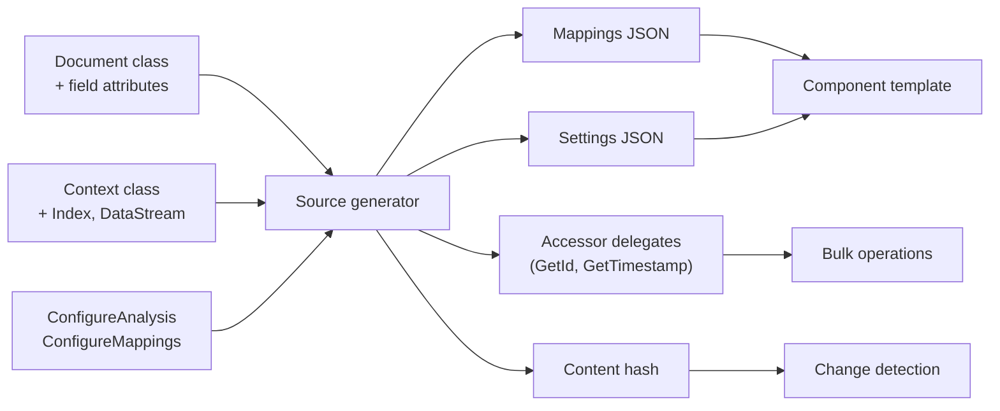

# Elastic.Mapping

Describe your Elasticsearch mapping with C# attributes. A source generator turns those declarations into component template JSON at compile time, so you never write mapping JSON by hand.

```csharp
public class Product
{
    [Id]
    [Keyword]
    public string Sku { get; set; }

    [Text(Analyzer = "standard")]
    public string Name { get; set; }

    [Keyword]
    public string Category { get; set; }
}

[ElasticsearchMappingContext]
[Index<Product>(Name = "products")]
public static partial class MyContext;
```

From this declaration, the source generator produces all the JSON, hashes, and metadata that `Elastic.Ingest.Elasticsearch` needs to create templates, send bulk requests, and manage indices.

## Install

```shell
dotnet add package Elastic.Ingest.Elasticsearch
```

This pulls in `Elastic.Mapping` (with the bundled source generator) and `Elastic.Channels` as transitive dependencies.

## What happens at compile time



The generator:

- Finds classes marked with `[ElasticsearchMappingContext]`
- Reads each `[Index<T>]`, `[DataStream<T>]`, or `[WiredStream<T>]` registration
- Walks the document type's properties to infer Elasticsearch field types
- Parses any `ConfigureAnalysis` / `ConfigureMappings` methods
- Emits a partial context class with everything the ingest channel needs

:::{dropdown} What exactly gets generated?
For each type registration, the generator emits:

- **Mappings JSON** for the component template `properties` section
- **Settings JSON** with shards, replicas, refresh interval
- **Combined SHA-256 hash** for change detection (skips template updates when unchanged)
- **Accessor delegates** like `GetId`, `GetTimestamp`, `GetContentHash`, `SetBatchIndexDate`
- **Index/search strategy metadata** with write target, date pattern, data stream name, aliases
- **ConfigureAnalysis delegate** wired to your analysis configuration method
- **MappingsBuilder extensions** with strongly-typed per-property fluent methods
- **Analysis name accessors** for compile-time verified analyzer/tokenizer/filter references
:::
