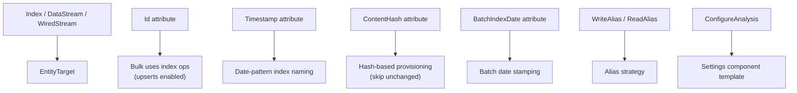

# Integration with Elastic.Ingest

Put attributes on your document type, declare a mapping context, and the ingest channel auto-configures itself. This page explains how the pieces connect.

## End-to-end example

```csharp
// 1. Document with attributes
public class Product
{
    [Id]
    [Keyword]
    public string Sku { get; set; }

    [Text(Analyzer = "product_analyzer")]
    public string Name { get; set; }

    [Keyword]
    public string Category { get; set; }

    [ContentHash]
    [Keyword]
    public string Hash { get; set; }
}

// 2. Mapping context with configuration
[ElasticsearchMappingContext]
[Index<Product>(
    Name = "products",
    WriteAlias = "products-write",
    ReadAlias = "products-search",
    DatePattern = "yyyy.MM.dd.HHmmss",
    Configuration = typeof(ProductConfig))]
public static partial class CatalogContext;

// 3. Create a channel (strategy is fully auto-resolved)
var options = new IngestChannelOptions<Product>(transport, CatalogContext.Product.Context);
using var channel = new IngestChannel<Product>(options);

await channel.BootstrapElasticsearchAsync(BootstrapMethod.Failure);

foreach (var product in products)
    channel.TryWrite(product);
```

From this declaration, the channel auto-resolves:

| Behavior | Resolved to | Why |
|----------|------------|-----|
| Entity target | `Index` | `[Index<T>]` used |
| Bulk operation | `index` (upsert) | `[Id]` present |
| Bootstrap | Component + index templates | Index target |
| Provisioning | Hash-based reuse | `[ContentHash]` present |
| Alias | Write + search aliases | `WriteAlias` / `ReadAlias` set |
| Index naming | `products-2026.07.23.120000` | `DatePattern` set |

## How attributes drive behavior



### Target attributes

| Attribute | EntityTarget | Bulk operation | Bootstrap |
|-----------|-------------|---------------|-----------|
| `[Index<T>]` | `Index` | `index` (with `[Id]`) or `create` | Component + index templates |
| `[DataStream<T>]` | `DataStream` | `create` (append-only) | Component + data stream templates |
| `[WiredStream<T>]` | `WiredStream` | `create` (append-only) | No-op (managed by Elasticsearch) |

### Field attributes

| Attribute | Generated delegate | Effect |
|-----------|-------------------|--------|
| `[Id]` | `GetId` | Bulk headers include `_id`, enabling upserts |
| `[Timestamp]` | `GetTimestamp` | Date-pattern index naming |
| `[ContentHash]` | `GetContentHash` | Reuse existing index if hash matches |
| `[BatchIndexDate]` | `SetBatchIndexDate` | All batch documents share one index date |
| `[LastUpdated]` | `SetLastUpdated` | Each document gets the write time |

### When an attribute is absent

| Absent attribute | Effect |
|-----------------|--------|
| No `[Id]` | Bulk uses `create` (no upserts) |
| No `[ContentHash]` | Always creates a new index on bootstrap |
| No `[Timestamp]` with `DatePattern` | Compile-time error |

## The handoff: ElasticsearchTypeContext

The source generator populates an `ElasticsearchTypeContext` record at compile time. The ingest channel reads it at runtime.

:::{dropdown} What the channel reads from the context

| Field | Used for |
|-------|----------|
| `GetSettingsJson()` | Component template (settings) |
| `GetMappingsJson()` | Component template (mappings) |
| `Hash` / `SettingsHash` | Change detection (skip update if unchanged) |
| `IndexStrategy` | Write target, date pattern, aliases |
| `SearchStrategy` | Read alias, search pattern |
| `EntityTarget` | Index vs DataStream vs WiredStream |
| `GetId()` | Bulk header `_id` field |
| `GetTimestamp()` | Date-pattern index naming |
| `GetContentHash()` | Hash-based reuse provisioning |
| `SetBatchIndexDate()` | Stamp batch date on documents |
| `SetLastUpdated()` | Stamp current time on documents |
| `ConfigureAnalysis` | Runtime analysis merge into settings |
| `IndexSettings` | Additional settings key-value pairs |
:::

## Bootstrap flow

When you call `channel.BootstrapElasticsearchAsync()`:

1. Reads settings and mappings JSON from the generated context
2. Merges custom analysis (if `ConfigureAnalysis` is configured)
3. Merges additional index settings (if `IndexSettings` is configured)
4. Computes the template name from the context
5. Checks the hash. If the template already exists with the same hash, skips the update
6. Creates or updates the component template
7. Creates or updates the index template
8. Provisions the index according to the provisioning strategy

## Package dependency

You only reference `Elastic.Ingest.Elasticsearch`. Everything else arrives transitively:

```
Elastic.Ingest.Elasticsearch
  └── Elastic.Mapping (includes source generator)
  └── Elastic.Ingest.Transport
        └── Elastic.Channels
```

:::{dropdown} Advanced: name resolution and DI integration

### Name resolution at runtime

The generated context provides resolve methods:

| Method | Returns |
|--------|---------|
| `ResolveIndexName(timestamp)` | Concrete index name (e.g. `products-2026.07.23.120000`) |
| `ResolveWriteAlias()` | Write alias name |
| `ResolveReadTarget()` | Best read target (read alias or write alias) |
| `ResolveSearchPattern()` | Wildcard pattern for templates |
| `ResolveDataStreamName()` | Full data stream name (`type-dataset-namespace`) |
| `ResolveTemplateName()` | Component/index template name |

For data streams, namespace resolution falls through environment variables:
`DOTNET_ENVIRONMENT` > `ASPNETCORE_ENVIRONMENT` > `ENVIRONMENT` > `"dev"`

### DI integration

The generator produces an `IElasticsearchMappingContext` implementation for dependency injection:

```csharp
services.AddSingleton<IElasticsearchMappingContext>(MyContext.Instance);

// Look up context by CLR type at runtime
if (MyContext.Instance.All.TryGetValue(typeof(Product), out var metadata))
{
    var indexName = metadata.ResolveIndexName(DateTimeOffset.UtcNow);
}
```

### IStaticMappingResolver

The generated resolver interface (`IStaticMappingResolver<T>`) provides:

- `Context` property (the `ElasticsearchTypeContext`)
- Field name dictionaries (`PropertyToField`, `FieldToProperty`)
- Typed setter delegates for `BatchIndexDate` and `LastUpdated`

Used by `MappingsBuilder.Merge`, `AnalysisBuilder.Merge`, and `IncrementalSyncOrchestrator`.
:::
