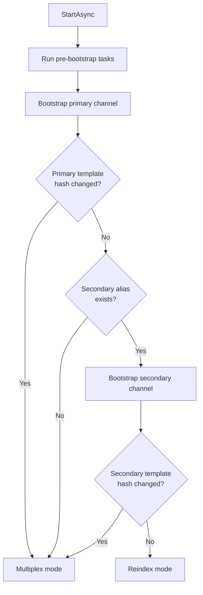
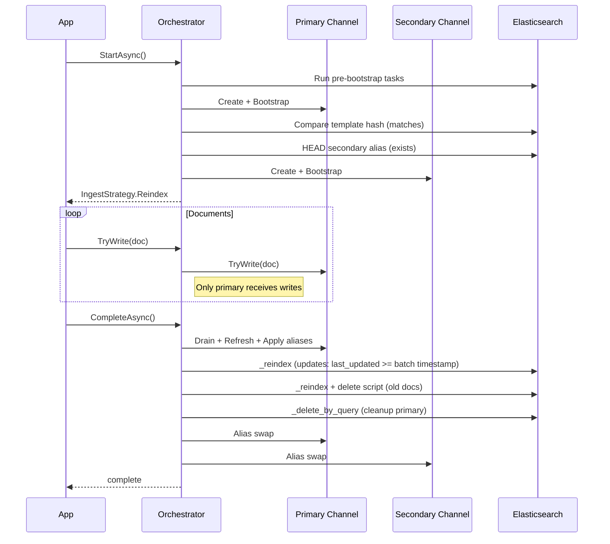
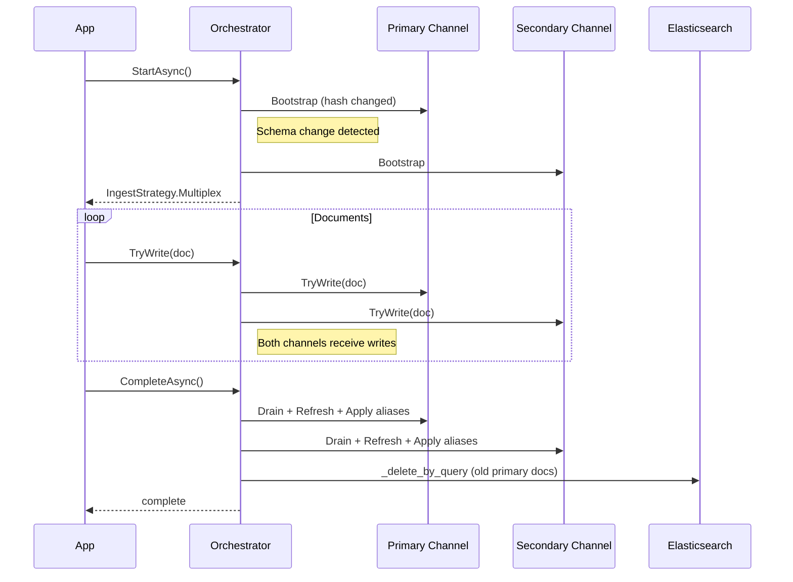

# IncrementalSyncOrchestrator

`IncrementalSyncOrchestrator<T>` coordinates a full incremental sync workflow with a primary and secondary channel. It handles strategy selection, ingestion routing, alias swapping, reindexing, and cleanup.

## Strategy decision

When `StartAsync` is called, the orchestrator bootstraps both channels and determines whether to use **reindex** or **multiplex** mode:



- **Reindex mode**: both schemas are unchanged and the secondary index exists. Only the primary channel receives writes; the secondary is updated via `_reindex` after drain.
- **Multiplex mode**: a schema has changed or the secondary index doesn't exist. Both channels receive every document simultaneously.

## Reindex mode



In reindex mode:
1. Only the primary channel receives writes (better performance)
2. After drain, documents modified since the batch timestamp are reindexed from primary to secondary
3. Old documents (before batch timestamp) are handled via a delete script
4. Both channels get their aliases swapped
5. Old documents are cleaned up from the primary

## Multiplex mode



In multiplex mode:
1. Both channels receive every document (handles schema differences)
2. After drain, both channels are refreshed and aliases are applied
3. Old documents are cleaned up from the primary

## API reference

### Constructor

```csharp
var orchestrator = new IncrementalSyncOrchestrator<TEvent>(
    ITransport transport,
    ElasticsearchTypeContext primary,
    ElasticsearchTypeContext secondary
);
```

### Properties

| Property | Type | Default | Description |
|----------|------|---------|-------------|
| `LastUpdatedField` | `string` | `"last_updated"` | Elasticsearch field name used for range queries when reindexing updates |
| `BatchIndexDateField` | `string` | `"batch_index_date"` | Elasticsearch field name used for range queries when deleting old documents |
| `ConfigurePrimary` | `Action<IngestChannelOptions<T>>?` | `null` | Callback to customize primary channel options before creation |
| `ConfigureSecondary` | `Action<IngestChannelOptions<T>>?` | `null` | Callback to customize secondary channel options before creation |
| `OnPostComplete` | `Func<OrchestratorContext<T>, CancellationToken, Task>?` | `null` | Hook that runs after `CompleteAsync` finishes all operations |
| `Strategy` | `IngestStrategy` | Read-only | The resolved strategy after `StartAsync` |
| `BatchTimestamp` | `DateTimeOffset` | Read-only | Timestamp captured at orchestrator creation |

### Methods

| Method | Description |
|--------|-------------|
| `AddPreBootstrapTask(Func<ITransport, CancellationToken, Task>)` | Add a task that runs before channel bootstrap (returns `this` for chaining) |
| `StartAsync(BootstrapMethod, string?, CancellationToken)` | Bootstrap channels and determine strategy |
| `TryWrite(TEvent)` | Non-blocking write (routes based on strategy) |
| `WaitToWriteAsync(TEvent, CancellationToken)` | Async write with backpressure |
| `TryWriteMany(IEnumerable<TEvent>)` | Batch non-blocking write |
| `WaitToWriteManyAsync(IEnumerable<TEvent>, CancellationToken)` | Batch async write |
| `CompleteAsync(TimeSpan?, CancellationToken)` | Drain, refresh, reindex/multiplex, alias swap, cleanup |
| `Dispose()` | Dispose primary and secondary channels |

## Complete example

This example mirrors `examples/Elastic.Ingest.MultiChannel/`:

```csharp
// Document type
public class KnowledgeArticle
{
    [Id] [Keyword]
    public string Url { get; set; }

    [Text(Analyzer = "standard")]
    public string Title { get; set; }

    [Text(Analyzer = "standard")]
    public string Body { get; set; }

    [ContentHash] [Keyword]
    public string Hash { get; set; }

    [Timestamp] [JsonPropertyName("@timestamp")]
    public DateTimeOffset UpdatedAt { get; set; }
}

// Mapping context with two variants
[ElasticsearchMappingContext]
[Entity<KnowledgeArticle>(
    Target = EntityTarget.Index,
    Name = "knowledge-lexical",
    WriteAlias = "knowledge-lexical",
    ReadAlias = "knowledge-lexical-search",
    SearchPattern = "knowledge-lexical-*",
    DatePattern = "yyyy.MM.dd.HHmmss"
)]
[Entity<KnowledgeArticle>(
    Target = EntityTarget.Index,
    Name = "knowledge-semantic",
    Variant = "Semantic",
    WriteAlias = "knowledge-semantic",
    ReadAlias = "knowledge-semantic-search",
    SearchPattern = "knowledge-semantic-*",
    DatePattern = "yyyy.MM.dd.HHmmss"
)]
public static partial class ExampleMappingContext;
```

```csharp
var transport = new DistributedTransport(
    new TransportConfiguration(new Uri("http://localhost:9200"))
);

using var orchestrator = new IncrementalSyncOrchestrator<KnowledgeArticle>(
    transport,
    primary: ExampleMappingContext.KnowledgeArticle.Context,
    secondary: ExampleMappingContext.KnowledgeArticleSemantic.Context
);

// Optional: configure channel options
orchestrator.ConfigurePrimary = opts =>
{
    opts.BufferOptions = new BufferOptions { OutboundBufferMaxSize = 5_000 };
};

// Optional: add pre-bootstrap tasks
orchestrator.AddPreBootstrapTask(async (t, ctx) =>
{
    // Create synonym sets, query rules, etc.
});

// Optional: add post-complete hook
orchestrator.OnPostComplete = async (context, ctx) =>
{
    Console.WriteLine($"Strategy: {context.Strategy}, Batch: {context.BatchTimestamp}");
};

// Start: bootstrap and determine strategy
var strategy = await orchestrator.StartAsync(BootstrapMethod.Failure);
Console.WriteLine($"Using strategy: {strategy}");

// Write documents
foreach (var article in await GetArticles())
    orchestrator.TryWrite(article);

// Complete: drain, reindex/multiplex, alias swap, cleanup
var success = await orchestrator.CompleteAsync(drainMaxWait: TimeSpan.FromSeconds(30));
Console.WriteLine($"Completed: {success}");
```

## Related

- [Catalog data](../use-cases/catalog-data.md): use case guide for catalog data with orchestration
- [Provisioning strategies](../strategies/provisioning.md): hash-based index reuse
- [Alias strategies](../strategies/alias.md): alias swapping behavior
